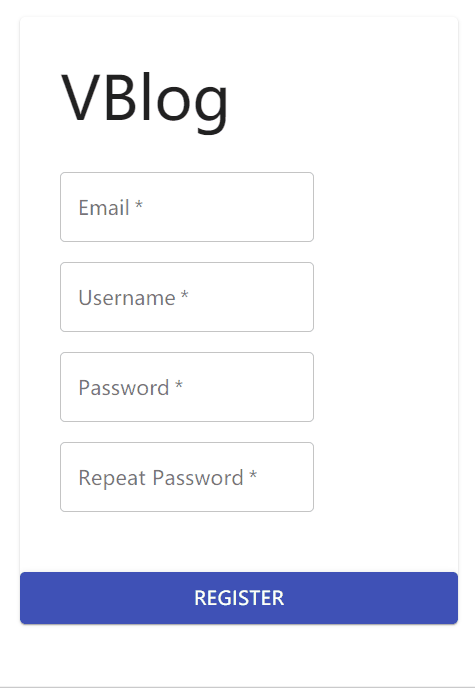
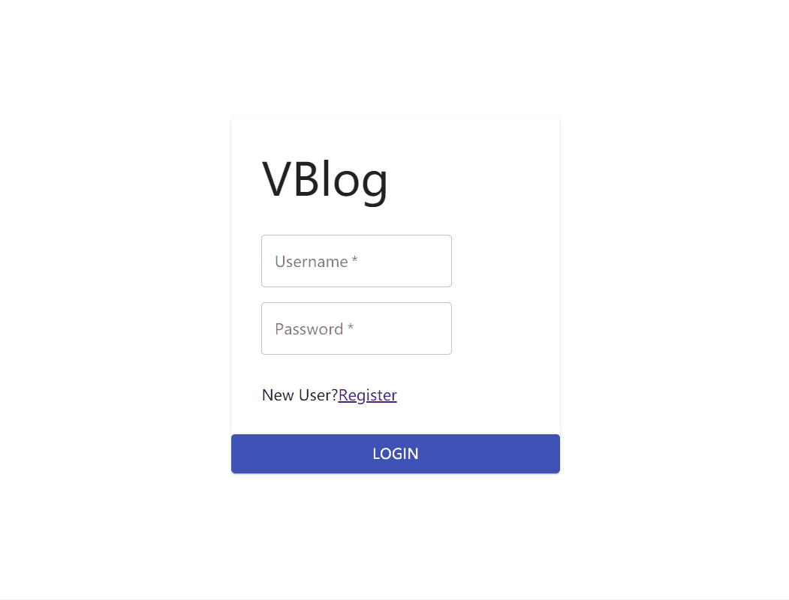
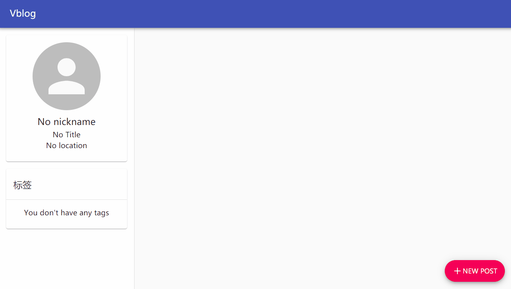

# Vblog

A modern, multi-user Markdown blog System.

Built with React JS, Spring Boot and Spring Security. This blog system is under development, it still contains many bugs and missing features.

# Features

## Register

## Login

## Markdown editing

## Content Reading

# Todo

- Log out
  - The authorization is based on JWT, logout is simply delete the token
- User Setting
  - Currently registered user can't change any of their settings
- User Feedback
  - Many element in UI is lacking proper user feedback
- Multiple tag support
  - Now you can only add 1 tag to an article
- Image and Avatar Uploading

