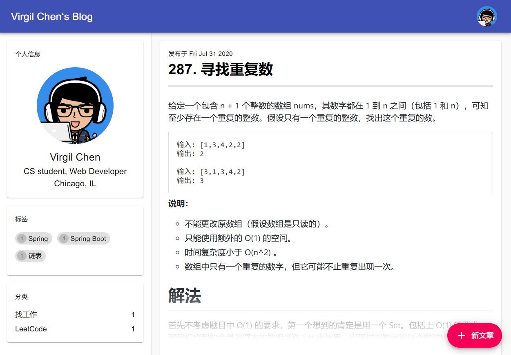

# Vblog


A modern, multi-user Markdown blog System.

Built with React JS, Spring Boot and Spring Security. This blog system is under development, it still contains many bugs and missing features.

Online demo: [Demo](http://blog.virgilchen.top)



# Features

- Modern SPA design
- Multi-user
- User individual blog home page
- Real time markdown editing
- Tag and Category support
- i18n support

# Run

### Clone the project

```
git clone git@github.com:VirgilChen97/Vblog.git
```

### Run backend service

```
cd vblog-server
mvn spring-boot:run
```

### Run frontend service

```
cd ../vblog-ui
npm start
```

# Todo

- Image uploading
- User Setting
  - Allow user to change App bar color, code highlighting theme, etc
- User Feedback
  - Many element in UI is lacking proper user feedback
- User friendly tag editor


